# PhoneMail — REST API Specification

> **Project:** PhoneMail (ALPHASTACK 7-Day Buildathon)  
> **Status:** Final API Design Baseline (Post Final Review Gate)  
> **Base URL:** `/api/v1`  
> **Backend Framework:** Node.js 20 LTS + TypeScript + Express (Frozen)  
> **Protocol:** HTTP/1.1 (Internal Port 4000; Host Port 3000 via Nginx or direct 4000)

---

## 1. Global Conventions & Standards

### 1.1 Authentication Scheme
Endpoints requiring authentication strictly enforce standard Bearer tokens in the `Authorization` header:
```http
Authorization: Bearer <JWT_TOKEN>
```
**Security Standard:** Query-string token authentication is strictly disallowed across all API endpoints, including attachment downloads. Query-token authentication (`?token=<JWT_TOKEN>`) is permitted **only** on Server-Sent Events (`GET /api/v1/events`), necessitated by browser native `EventSource` header restrictions.

### 1.2 Response Envelope
- **Single Entity Success:**
  ```json
  {
    "success": true,
    "data": { ... }
  }
  ```
- **Paginated Collection Success:**
  ```json
  {
    "success": true,
    "data": [ ... ],
    "meta": {
      "page": 1,
      "limit": 25,
      "total": 54,
      "totalPages": 3
    }
  }
  ```
- **Standard RFC 7807 Error Response:**
  ```json
  {
    "success": false,
    "error": {
      "code": "RESOURCE_NOT_FOUND",
      "message": "The requested resource could not be found.",
      "details": null,
      "timestamp": "2026-09-28T12:00:00.000Z"
    }
  }
  ```

---

## 2. System & Health Endpoints

### 2.1 System Healthcheck
- **Endpoint:** `GET /api/v1/health`
- **Auth:** Public
- **Description:** Verifies API health, PostgreSQL database connection, local SMTP listener status, and active telephony provider mode.
- **Responses:**
  - `200 OK`:
    ```json
    {
      "success": true,
      "data": {
        "status": "healthy",
        "timestamp": "2026-09-28T12:00:00.000Z",
        "services": {
          "database": "connected",
          "inboundSmtp": "listening_on_port_2525",
          "telephonyProvider": "mock"
        },
        "version": "1.0.0"
      }
    }
    ```
  - `503 Service Unavailable`: Database or SMTP daemon disconnected.

---

## 3. Authentication & Onboarding Endpoints

Authentication separates OTP verification from account creation. The system provides explicit, deterministic flows for **Registration** and **Login**.

```mermaid
flowchart TD
    subgraph RegistrationFlow["Registration Flow"]
        R1["1. POST /auth/request-otp<br>(purpose: 'REGISTRATION')"] --> R2["2. POST /auth/verify-otp<br>(Validates OTP code)"]
        R2 -->|Returns verificationToken| R3["3. POST /auth/register OR /auth/register-web<br>(Creates user, assigns phone@domain)"]
        R3 --> R4["4. Returns Authenticated Session JWT"]
    end

    subgraph LoginFlow["Login Flow"]
        L1["1. POST /auth/request-otp<br>(purpose: 'LOGIN')"] --> L2["2. POST /auth/verify-otp<br>(Validates OTP code)"]
        L2 -->|Returns verificationToken| L3["3. POST /auth/login-otp<br>(Finds existing user)"]
        L3 --> L4["4. Returns Authenticated Session JWT"]
    end
```



---

### 3.0 OTP Verification Token Security Rules
The `verificationToken` issued upon successful OTP verification is governed by strict cryptographic and authorization policies:
1. **Strict Purpose Binding:**
   - A `REGISTRATION` verificationToken (`purpose = "REGISTRATION"`) can **strictly and only** be redeemed by registration endpoints (`POST /api/v1/auth/register-web` or `POST /api/v1/auth/register`).
   - A `LOGIN` verificationToken (`purpose = "LOGIN"`) can **strictly and only** be redeemed by the login endpoint (`POST /api/v1/auth/login-otp`).
   - Attempting to use a `REGISTRATION` verificationToken to log in via `/auth/login-otp` will be rejected with `HTTP 403 Forbidden` (`code: "INVALID_TOKEN_PURPOSE"`).
   - Attempting to use a `LOGIN` verificationToken to register an account via `/auth/register` or `/auth/register-web` will be rejected with `HTTP 403 Forbidden` (`code: "INVALID_TOKEN_PURPOSE"`).
2. **Short Lifetime:** Verification tokens expire after 600 seconds (10 minutes) from issuance.
3. **Single-Use Invalidation:** Verification tokens are strictly single-use and are invalidated immediately upon successful account creation or session issuance.
4. **Phone Binding:** The token cryptographically signs `{ phone, purpose, verifiedAt }`. Any mismatch between the submitted phone number and the token payload results in `HTTP 401 Unauthorized`.

---

### 3.1 Request OTP
- **Endpoint:** `POST /api/v1/auth/request-otp`
- **Auth:** Public
- **Description:** Generates a 6-digit OTP for the specified phone number tied to an explicit purpose.
- **Business Validations:**
  - When `purpose = 'REGISTRATION'`: Verifies that the phone number is not already registered. If registered, returns `409 Conflict`.
  - When `purpose = 'LOGIN'`: Verifies that the user already exists. If not found, returns `404 Not Found`.
- **Request Body:**
  ```json
  {
    "phone": "9888820532",
    "purpose": "REGISTRATION"
  }
  ```
  *(Supported purposes: `"REGISTRATION"`, `"LOGIN"`)*
- **Responses:**
  - `200 OK`:
    ```json
    {
      "success": true,
      "data": {
        "phone": "9888820532",
        "purpose": "REGISTRATION",
        "message": "OTP generated and sent.",
        "expiresInSeconds": 300,
        "cooldownSeconds": 60,
        "mockOtp": "123456"
      }
    }
    ```
    *(Note: `mockOtp` is returned only when `TELEPHONY_PROVIDER=mock`).*
  - `409 Conflict`: "An account with this phone number already exists." (When purpose is REGISTRATION).
  - `404 Not Found`: "No account found for this phone number." (When purpose is LOGIN).
  - `429 Too Many Requests`: Rate limit exceeded (cooldown active).

---

### 3.2 Verify OTP (Strict Verification Only)
- **Endpoint:** `POST /api/v1/auth/verify-otp`
- **Auth:** Public
- **Description:** **ONLY verifies the OTP** against the stored hash and returns a short-lived `verificationToken`. It does **NOT** automatically create an account, and does **NOT** issue a long-lived user session.
- **Request Body:**
  ```json
  {
    "phone": "9888820532",
    "otp": "123456",
    "purpose": "REGISTRATION"
  }
  ```
- **Responses:**
  - `200 OK`:
    ```json
    {
      "success": true,
      "data": {
        "verified": true,
        "phone": "9888820532",
        "purpose": "REGISTRATION",
        "verificationToken": "vtok_eyJhbGciOi...",
        "expiresInSeconds": 600,
        "message": "OTP verified successfully."
      }
    }
    ```
  - `400 Bad Request`: Incorrect OTP code (`details: { attemptsRemaining: 2 }`).
  - `410 Gone`: OTP has expired.

---

### 3.3 Web Registration (Minimal 2-Input Flow)
- **Endpoint:** `POST /api/v1/auth/register-web`
- **Auth:** Public (Requires `verificationToken`)
- **Description:** Implements Requirement 6.1.3:
  - **UI Specification:** The Web Registration UI contains strictly **two visible input fields**:
    1. `Phone Number` (input field)
    2. `OTP` (input field)
    Followed by the `Next` action button.
  - **Terms of Service:** Displayed as static text containing a hyperlink: *"By signing up, you agree to the [Terms of Service](file:///terms)"*. It is **not** a third visible input field or checkbox.
  - **Field Reset:** After successful creation, the registration input fields reset for a new account creation attempt per Requirement 6.1.3.
- **Request Body:**
  ```json
  {
    "phone": "9888820532",
    "verificationToken": "vtok_eyJhbGciOi..."
  }
  ```
- **Responses:**
  - `201 Created`:
    ```json
    {
      "success": true,
      "data": {
        "message": "PhoneMail account created successfully.",
        "token": "eyJhbGciOi...",
        "user": {
          "id": "c1f7a29e-...",
          "phone": "9888820532",
          "email": "9888820532@phonemail.com",
          "hasNativeApp": false,
          "preferredLanguage": "en"
        }
      }
    }
    ```
  - `400 Bad Request`: Invalid or expired verification token.
  - `409 Conflict`: Account already exists.

---

### 3.4 General / Mobile Registration
- **Endpoint:** `POST /api/v1/auth/register`
- **Auth:** Public (Requires `verificationToken`)
- **Description:** Explicit account creation for mobile onboarding or general clients, allowing setting of display name and language selected in Screen 1.
- **Request Body:**
  ```json
  {
    "phone": "9888820532",
    "verificationToken": "vtok_eyJhbGciOi...",
    "displayName": "Alex Rivera",
    "preferredLanguage": "en"
  }
  ```
- **Responses:**
  - `201 Created`: Returns authenticated JWT session token and created user record.
  - `400 Bad Request`: Invalid token.

---

### 3.5 Login with Verified OTP
- **Endpoint:** `POST /api/v1/auth/login-otp`
- **Auth:** Public (Requires `verificationToken`)
- **Description:** Completes the login flow after successful OTP verification. Finds existing account and issues an authenticated session token.
- **Request Body:**
  ```json
  {
    "phone": "9888820532",
    "verificationToken": "vtok_eyJhbGciOi..."
  }
  ```
- **Responses:**
  - `200 OK`:
    ```json
    {
      "success": true,
      "data": {
        "token": "eyJhbGciOi...",
        "user": {
          "id": "c1f7a29e-...",
          "phone": "9888820532",
          "email": "9888820532@phonemail.com",
          "hasNativeApp": false,
          "preferredLanguage": "en"
        }
      }
    }
    ```
  - `404 Not Found`: Account does not exist. Please register first.

---

### 3.6 Password Authentication (Fallback)
- **Endpoint:** `POST /api/v1/auth/login-password`
- **Auth:** Public
- **Description:** Authenticates user via phone/email and password when OTP provider is unavailable (Req 6.3.2).
- **Request Body:**
  ```json
  {
    "phoneOrEmail": "9888820532",
    "password": "Password123!"
  }
  ```
- **Responses:**
  - `200 OK`: Returns JWT token and user profile.
  - `401 Unauthorized`: Invalid credentials.

---

## 4. User Profile & App Capability Endpoints

### 4.1 Get Profile
- **Endpoint:** `GET /api/v1/user/profile`
- **Auth:** Bearer Token
- **Responses:**
  - `200 OK`: Returns user profile including `hasNativeApp` status and `preferredLanguage`.

### 4.2 Update Profile
- **Endpoint:** `PUT /api/v1/user/profile`
- **Auth:** Bearer Token
- **Request Body:**
  ```json
  {
    "displayName": "Alex Rivera",
    "preferredLanguage": "hi",
    "avatarUrl": "https://..."
  }
  ```

### 4.3 Register Native Mobile Device (Explicit Capability)
- **Endpoint:** `POST /api/v1/user/native-device`
- **Auth:** Bearer Token
- **Description:** Called **strictly** by the native mobile application (APK) upon launch. Sets `has_native_app = true` so SMS notifications are suppressed in favor of native app delivery. Responsive mobile web browsing never calls this endpoint.
- **Request Body:**
  ```json
  {
    "devicePlatform": "android",
    "appVersion": "1.0.0"
  }
  ```
- **Responses:**
  - `200 OK`: `{ "success": true, "data": { "hasNativeApp": true } }`

---

### 4.4 List User Aliases (Requirement 6.18)
- **Endpoint:** `GET /api/v1/user/aliases`
- **Auth:** `Authorization: Bearer <JWT_TOKEN>`
- **Description:** Retrieves all active and inactive email aliases configured for the authenticated user.
- **Responses:**
  - `200 OK`:
    ```json
    {
      "success": true,
      "data": [
        {
          "id": "al-9a1b2c3d...",
          "aliasAddress": "work.alex@phonemail.com",
          "aliasName": "work.alex",
          "isActive": true,
          "createdAt": "2026-09-28T14:00:00.000Z"
        }
      ]
    }
    ```

---

### 4.5 Create User Alias (Requirement 6.18)
- **Endpoint:** `POST /api/v1/user/aliases`
- **Auth:** `Authorization: Bearer <JWT_TOKEN>`
- **Description:** Creates an alternative email identity for the user. Incoming emails sent to this alias address are routed directly to the user's primary mailbox.
- **Request Body:**
  ```json
  {
    "aliasName": "work.alex"
  }
  ```
- **Responses:**
  - `201 Created`:
    ```json
    {
      "success": true,
      "data": {
        "id": "al-9a1b2c3d...",
        "aliasAddress": "work.alex@phonemail.com",
        "aliasName": "work.alex",
        "isActive": true,
        "createdAt": "2026-09-28T14:00:00.000Z"
      }
    }
    ```
  - `400 Bad Request`: Invalid alias format (must contain alphanumeric characters, dots, or hyphens only).
  - `409 Conflict`: Alias address is already in use.

---

### 4.6 Deactivate User Alias (Requirement 6.18)
- **Endpoint:** `DELETE /api/v1/user/aliases/:id`
- **Auth:** `Authorization: Bearer <JWT_TOKEN>`
- **Description:** Deactivates or removes the specified alias. Once deactivated, incoming emails addressed to it will be rejected by the SMTP server.
- **Responses:**
  - `200 OK`:
    ```json
    {
      "success": true,
      "message": "Alias deactivated successfully."
    }
    ```
  - `404 Not Found`: Alias does not exist or does not belong to the authenticated user.

---

## 5. Mobile Recipient Search & Conversation Endpoints (WhatsApp-Style)

### 5.1 Lookup Recipient by Phone or Email
- **Endpoint:** `GET /api/v1/mobile/recipients/lookup`
- **Auth:** Bearer Token
- **Description:** Supports the core mobile workflow: **Search phone number -> determine registration status -> open/create conversation -> compose**.
- **Query Parameters:**
  - `query`: Phone number (e.g. `9876543210`) or email address (e.g. `user@external.com`).
- **Responses:**
  - `200 OK`:
    ```json
    {
      "success": true,
      "data": {
        "query": "9876543210",
        "resolvedAddress": "9876543210@phonemail.com",
        "isPhoneMailUser": true,
        "user": {
          "id": "e4b2...",
          "phone": "9876543210",
          "email": "9876543210@phonemail.com",
          "displayName": "Sarah Miller"
        },
        "hasExistingConversation": true,
        "existingConversationId": "7b8e1a4f-..."
      }
    }
    ```

---

### 5.2 Open or Create Conversation
- **Endpoint:** `POST /api/v1/mobile/conversations/open`
- **Auth:** Bearer Token
- **Description:** Given a recipient phone number or email, returns the existing 1-to-1 conversation if one already exists, or creates and returns a new 1-to-1 conversation ready for message composition.
- **Request Body:**
  ```json
  {
    "recipient": "9876543210"
  }
  ```
- **Responses:**
  - `200 OK`: Returns conversation object with `id`, `participants`, and `isNew: false`.
  - `201 Created`: Returns newly initialized conversation object with `isNew: true`.

---

### 5.3 List Mobile Conversations
- **Endpoint:** `GET /api/v1/mobile/conversations`
- **Auth:** Bearer Token
- **Query Parameters:**
  - `filter`: `all` (default), `unread`, `attachments`, `favorites`
  - `folder`: `home` (default), `drafts`, `spam`, `trash`
  - `search`: Filter text
- **Responses:**
  - `200 OK`: Returns array of conversation items with contact details, snippet of latest message, timestamp, unreadCount, and filter flags.

---

### 5.4 Get Conversation Thread & Messages
- **Endpoint:** `GET /api/v1/mobile/conversations/:id`
- **Auth:** Bearer Token
- **Responses:**
  - `200 OK`:
    ```json
    {
      "success": true,
      "data": {
        "conversation": {
          "id": "7b8e1a4f-...",
          "isGroup": false,
          "title": "Project Deliverables",
          "participants": [
            { "phone": "9888820532", "email": "9888820532@phonemail.com" },
            { "phone": "9876543210", "email": "9876543210@phonemail.com" }
          ]
        },
        "messages": [
          {
            "id": "msg-001",
            "senderEmail": "9876543210@phonemail.com",
            "senderPhone": "9876543210",
            "subject": "Project Deliverables",
            "bodyText": "Attached are the design files.",
            "inReplyToId": null,
            "canReply": true,
            "hasAttachments": true,
            "attachments": [
              {
                "id": "att-1",
                "filename": "specs.pdf",
                "fileSizeBytes": 1048576,
                "contentType": "application/pdf",
                "downloadUrl": "/api/v1/attachments/att-1/download"
              }
            ],
            "timestamp": "2026-09-28T14:00:00.000Z"
          },
          {
            "id": "msg-002",
            "senderEmail": "9888820532@phonemail.com",
            "senderPhone": "9888820532",
            "subject": "",
            "bodyText": "Thanks, looks great!",
            "inReplyToId": "msg-001",
            "canReply": false,
            "hasAttachments": false,
            "attachments": [],
            "timestamp": "2026-09-28T14:15:00.000Z"
          }
        ]
      }
    }
    ```

---

### 5.5 Send Message / Reply in Conversation
- **Endpoint:** `POST /api/v1/mobile/conversations/:id/messages`
- **Auth:** Bearer Token
- **Description:** Enforces WhatsApp-style email rules:
  - If replying (`inReplyToId` present), `subject` is omitted/hidden.
  - Enforces the **single-reply restriction**: The PostgreSQL unique partial index `idx_messages_single_reply` (`WHERE in_reply_to_id IS NOT NULL`) guarantees at the database level that one parent message can have at most one reply. The API / service layer catches the resulting uniqueness constraint violation (`23505`) and returns `409 Conflict`.
  - If new email, `subject` is required.
- **Request Body:**
  ```json
  {
    "inReplyToId": "msg-001",
    "subject": null,
    "bodyText": "Reviewed and approved.",
    "attachmentIds": []
  }
  ```
- **Responses:**
  - `201 Created`: Message sent via SMTP and persisted.
  - `409 Conflict`:
    ```json
    {
      "success": false,
      "error": {
        "code": "ALREADY_REPLIED",
        "message": "The referenced message has already been replied to."
      }
    }
    ```

---

## 6. Draft Lifecycle Endpoints

Drafts are cleanly modeled using the canonical `messages` table (`is_draft = true`) and `mailbox_items` (`folder = 'DRAFTS'`).

### 6.1 Create Draft
- **Endpoint:** `POST /api/v1/drafts`
- **Auth:** Bearer Token
- **Request Body:**
  ```json
  {
    "conversationId": null,
    "to": ["partner@example.com"],
    "cc": [],
    "bcc": [],
    "subject": "Proposal draft",
    "bodyText": "Draft body text...",
    "bodyHtml": "<p>Draft body text...</p>",
    "attachmentIds": []
  }
  ```
- **Responses:**
  - `201 Created`: Returns draft message object with `id` and `isDraft: true`.

---

### 6.2 List Drafts
- **Endpoint:** `GET /api/v1/drafts`
- **Auth:** Bearer Token
- **Responses:**
  - `200 OK`: Returns array of active draft items owned by the authenticated user.

---

### 6.3 Get Single Draft
- **Endpoint:** `GET /api/v1/drafts/:id`
- **Auth:** Bearer Token
- **Responses:**
  - `200 OK`: Returns draft details including recipients, subject, body, and attached files.

---

### 6.4 Update Draft
- **Endpoint:** `PUT /api/v1/drafts/:id`
- **Auth:** Bearer Token
- **Request Body:**
  ```json
  {
    "to": ["partner@example.com", "9876543210@phonemail.com"],
    "cc": ["manager@example.com"],
    "bcc": [],
    "subject": "Proposal draft v2",
    "bodyText": "Updated draft body text...",
    "bodyHtml": "<p>Updated draft body text...</p>",
    "attachmentIds": ["att-1"]
  }
  ```
- **Responses:**
  - `200 OK`: Returns updated draft object.

---

### 6.5 Delete Draft
- **Endpoint:** `DELETE /api/v1/drafts/:id`
- **Auth:** Bearer Token
- **Responses:**
  - `200 OK`: `{ "success": true, "message": "Draft deleted." }`

---

### 6.6 Send Draft
- **Endpoint:** `POST /api/v1/drafts/:id/send`
- **Auth:** Bearer Token
- **Description:** Finalizes the draft: generates an RFC `Message-ID`, sets `is_draft = false`, moves author's mailbox item to `SENT`, creates recipient `mailbox_items` for internal PhoneMail recipients, queues outbound delivery via `nodemailer`, and triggers SMS notifications if recipients lack the native app.
- **Responses:**
  - `200 OK`:
    ```json
    {
      "success": true,
      "data": {
        "messageId": "msg-draft-123",
        "rfcMessageId": "<202609281500.123@phonemail.com>",
        "status": "SENT"
      }
    }
    ```

---

## 7. Traditional Mailbox Endpoints (Web / Gmail-Style)

### 7.1 List Mailbox Items
- **Endpoint:** `GET /api/v1/emails`
- **Auth:** Bearer Token
- **Query Parameters:**
  - `folder`: `HOME` (default), `SENT`, `DRAFTS`, `SPAM`, `TRASH`
  - `page`: default `1`
  - `limit`: default `25`
  - `search`: search term
- **Responses:**
  - `200 OK`: Returns paginated list of mailbox items with sender, recipients summary, subject snippet, timestamp, `isRead`, and `isFavorite`.

---

### 7.2 Get Single Email Details
- **Endpoint:** `GET /api/v1/emails/:id`
- **Auth:** Bearer Token
- **Responses:**
  - `200 OK`: Full message details including sender, recipients (`to`, `cc`, `bcc`), subject, sanitized HTML body, plain text body, raw RFC headers, and attachments list.

---

### 7.3 Send Traditional Email Directly
- **Endpoint:** `POST /api/v1/emails/send`
- **Auth:** Bearer Token
- **Request Body:**
  ```json
  {
    "to": ["partner@example.com", "9876543210@phonemail.com"],
    "cc": ["team@example.com"],
    "bcc": [],
    "subject": "Weekly Status Update",
    "bodyText": "Attached is the weekly report.",
    "bodyHtml": "<p>Attached is the <b>weekly report</b>.</p>",
    "attachmentIds": []
  }
  ```
- **Responses:**
  - `200 OK`: Message queued and dispatched.

---

### 7.4 Mailbox Actions (Star, Read, Move Folder)
- `PATCH /api/v1/emails/:id/star`: `{ "isFavorite": true }` (Bearer Token)
- `PATCH /api/v1/emails/:id/read`: `{ "isRead": true }` (Bearer Token)
- `PATCH /api/v1/emails/:id/folder`: `{ "folder": "TRASH" | "SPAM" | "HOME" }` (Bearer Token)
- `DELETE /api/v1/emails/:id`: Permanently purges email from Trash (Bearer Token)

---

## 8. File Attachment Endpoints

### 8.1 Upload Attachment
- **Endpoint:** `POST /api/v1/attachments/upload`
- **Auth:** Bearer Token
- **Content-Type:** `multipart/form-data`
- **Description:** Uploads a file attachment for an email draft or composition.
- **Responses:**
  - `201 Created`:
    ```json
    {
      "success": true,
      "data": {
        "id": "att-4f8a...",
        "filename": "financial_report.pdf",
        "fileSizeBytes": 524288,
        "contentType": "application/pdf",
        "downloadUrl": "/api/v1/attachments/att-4f8a.../download"
      }
    }
    ```

---

### 8.2 Download Attachment
- **Endpoint:** `GET /api/v1/attachments/:id/download`
- **Auth:** `Authorization: Bearer <JWT_TOKEN>` (Standard Bearer token required. Query-string tokens are strictly NOT supported).
- **Description:** Streams the binary attachment with appropriate headers:
  ```http
  Content-Disposition: attachment; filename="financial_report.pdf"
  Content-Type: application/pdf
  ```
- **Responses:**
  - `200 OK`: Binary file stream.
  - `401 Unauthorized`: Missing or invalid Bearer token.
  - `404 Not Found`: If attachment does not exist.

---

## 9. Global Search API

### 9.1 Unified Search
- **Endpoint:** `GET /api/v1/search`
- **Auth:** Bearer Token
- **Query Parameters:**
  - `q`: Search keyword or phone number
- **Responses:**
  - `200 OK`: Returns matched conversations and emails with highlights.

---

## 10. Telephony & Webhook Endpoints (Twilio & Mock)

### 10.1 IVR Voice Webhook
- **Endpoint:** `POST /api/v1/telephony/ivr/voice`
- **Auth:** Twilio Signature Validation (when `TELEPHONY_PROVIDER=twilio`)
- **Content-Type:** Returns `text/xml` (TwiML)
- **Response:**
  ```xml
  <?xml version="1.0" encoding="UTF-8"?>
  <Response>
      <Gather action="/api/v1/telephony/ivr/gather" method="POST" numDigits="1" timeout="10">
          <Say language="en-US">Welcome to PhoneMail. Press 1 to create your account.</Say>
      </Gather>
      <Say language="en-US">We did not receive any input. Goodbye.</Say>
      <Hangup/>
  </Response>
  ```

---

### 10.2 IVR DTMF Selection Webhook
- **Endpoint:** `POST /api/v1/telephony/ivr/gather`
- **Auth:** Twilio Signature Validation (when `TELEPHONY_PROVIDER=twilio`)
- **Payload:** `Digits=1`, `From=+19888820532`, `CallSid=CA12345`
- **Description:** Creates the user account with `has_native_app = false` and sends confirmation SMS.
- **Response:**
  ```xml
  <?xml version="1.0" encoding="UTF-8"?>
  <Response>
      <Say language="en-US">Your PhoneMail account has been created. A confirmation text has been sent.</Say>
      <Hangup/>
  </Response>
  ```

### 10.3 Inbound SMS Account Creation Webhook
- **Endpoint:** `POST /api/v1/telephony/sms/inbound`
- **Auth:** Twilio Signature Validation via `X-Twilio-Signature` header (enforced when `TELEPHONY_PROVIDER=twilio`; bypassed in mock mode).
- **Content-Type:** `application/x-www-form-urlencoded`
- **Description:** Implements SMS-based account creation per Requirement 6.1.2:
  - **Parameters:**
    - `From`: Sender phone number in E.164 format (e.g. `+19888820532`).
    - `Body`: Inbound text content (e.g. `CREATE` or arbitrary registration keyword).
    - `MessageSid`: Unique provider message identifier.
    - `AccountSid`: Twilio account identifier.
  - **Normalization:** Normalizes phone number by stripping country code prefix and formatting characters down to canonical numeric digits (`9888820532`).
  - **Idempotency & Account Creation:**
    - Checks `users` table for existing account matching normalized phone number.
    - If user does **not** exist:
      - Creates user record with:
        - `phone_number = '9888820532'`
        - `email_address = '9888820532@phonemail.com'` (using `EMAIL_DOMAIN`)
        - `registration_source = 'SMS'`
        - `has_native_app = false` (eligible for SMS notifications per Req 6.16)
        - `preferred_language = 'en'`
      - Sends confirmation SMS: *"Welcome to PhoneMail! Your email address 9888820532@phonemail.com has been created. You can send and receive emails immediately."*
    - If user **already** exists:
      - Idempotent: Does not fail and does not overwrite existing data.
      - Sends informational confirmation SMS: *"You already have an active PhoneMail account: 9888820532@phonemail.com. Log in via web or mobile to access your messages."*
- **Response (TwiML XML):**
  ```xml
  <?xml version="1.0" encoding="UTF-8"?>
  <Response>
      <Message>Welcome to PhoneMail! Your email address 9888820532@phonemail.com has been created.</Message>
  </Response>
  ```

---

### 10.4 Local SMS Simulation (Deterministic Dev Testing)
- **Endpoint:** `POST /api/v1/telephony/mock/simulate-sms`
- **Auth:** Public / Dev
- **Content-Type:** `application/json`
- **Description:** Simulates an incoming SMS to create an account locally without requiring an active Twilio number or webhook tunnel.
- **Request Body:**
  ```json
  {
    "from": "+19888820532",
    "body": "CREATE"
  }
  ```
- **Responses:**
  - `200 OK`:
    ```json
    {
      "success": true,
      "data": {
        "phone": "9888820532",
        "email": "9888820532@phonemail.com",
        "isNewUser": true,
        "registrationSource": "SMS",
        "hasNativeApp": false,
        "confirmationSms": "Welcome to PhoneMail! Your email address 9888820532@phonemail.com has been created.",
        "twiml": "<?xml version=\"1.0\" encoding=\"UTF-8\"?><Response><Message>Welcome to PhoneMail! Your email address 9888820532@phonemail.com has been created.</Message></Response>"
      }
    }
    ```

---

### 10.5 Mock Telephony Inspector & Dev Tools
- `GET /api/v1/telephony/mock/messages`: Lists recent simulated outbound SMS messages (OTPs, notifications, and account creation confirmations) stored in memory (Auth: Public/Dev).
- `POST /api/v1/telephony/mock/simulate-call`: Simulates an incoming IVR phone call with DTMF digits (Auth: Public/Dev).
- `DELETE /api/v1/telephony/mock/messages`: Clears mock messages buffer for test isolation (Auth: Public/Dev).

---

## 11. Real-Time Event Stream (Server-Sent Events)

### 11.1 Events Stream
- **Endpoint:** `GET /api/v1/events`
- **Auth:** `?token=<JWT_TOKEN>` query parameter or `Authorization: Bearer <JWT_TOKEN>`
- **Transport:** Server-Sent Events (`text/event-stream`)
- **Payload Event Types:**
  - `NEW_EMAIL`: Dispatched when an inbound email is ingested via SMTP.
  - `CONVERSATION_UPDATED`: Dispatched when a message is added to a conversation.
  - `DRAFT_SAVED`: Dispatched when a draft is updated.
  - `SMS_DISPATCHED`: Dispatched when an SMS alert is sent.
