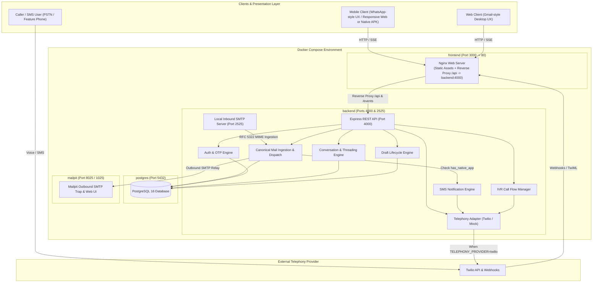
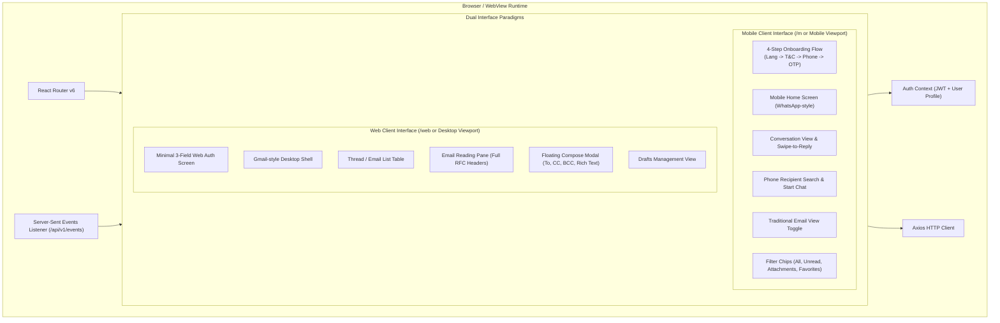
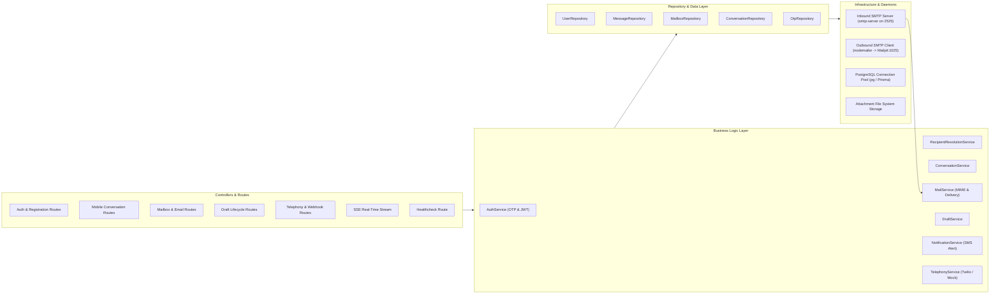
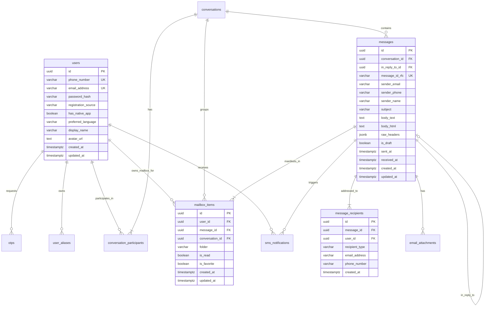
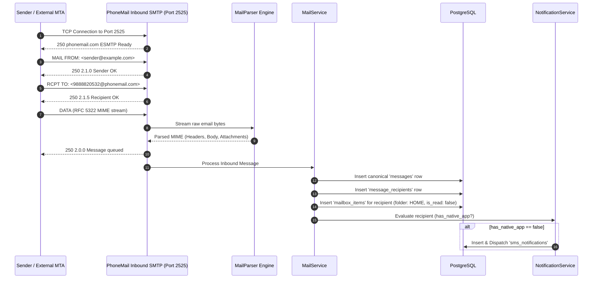
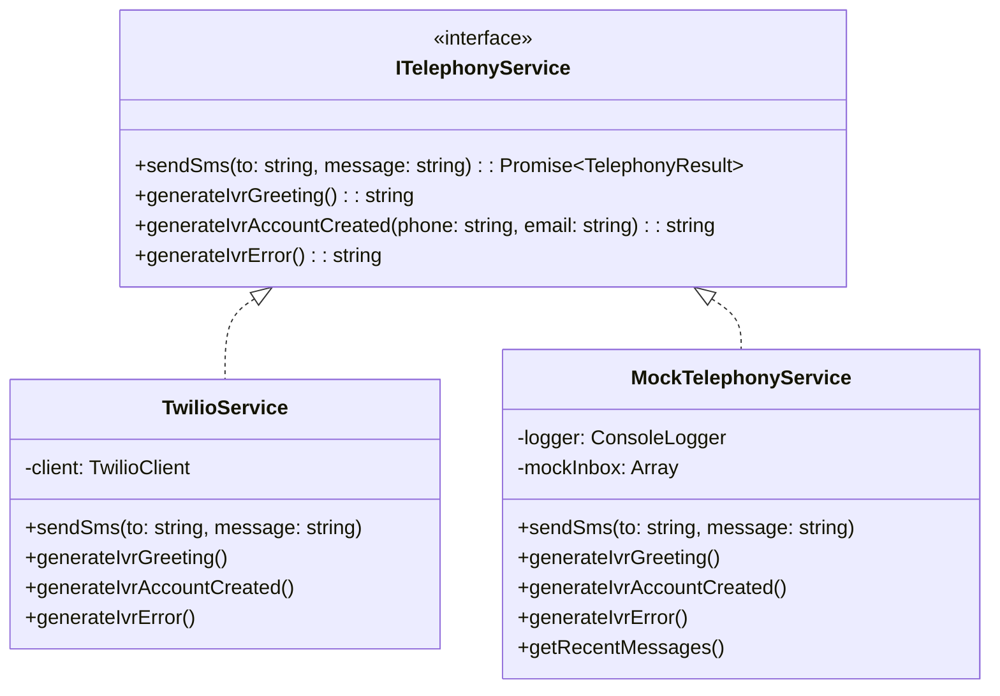
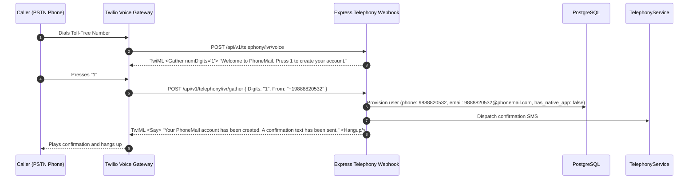
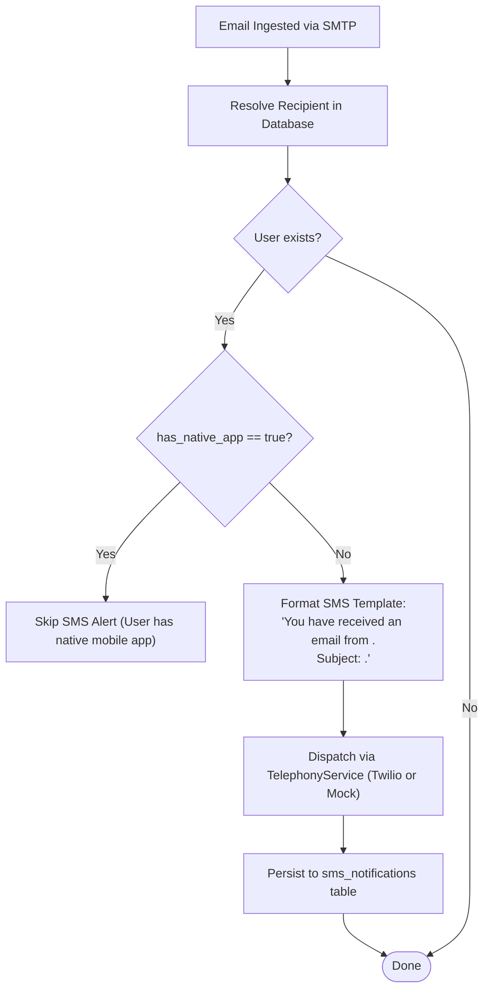
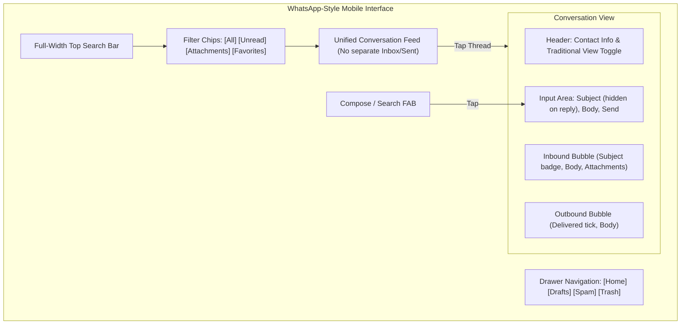
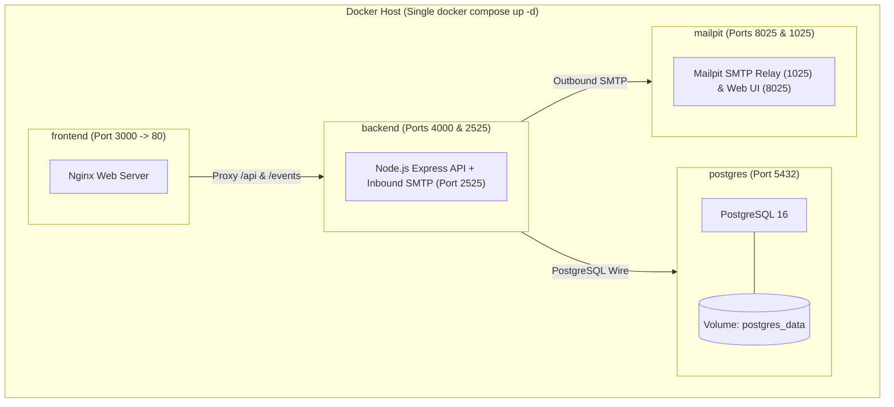

# PhoneMail — System Architecture Document

> **Project:** PhoneMail (ALPHASTACK 7-Day Buildathon)  
> **Status:** Revised Architecture Baseline (Post Consistency Review)  
> **Backend Stack:** Node.js (v20 LTS) + TypeScript + Express (Frozen)  
> **Database:** PostgreSQL 16  
> **Local SMTP:** Node.js `smtp-server` listening on port `2525` (Standard unprivileged host port)  
> **Frontend Stack:** React 18 + TypeScript + Vite + Tailwind CSS (Served via Nginx)  
> **Deployment Target:** Docker Compose (`docker compose up -d`)

---

## 1. Overall System Architecture

PhoneMail is a phone-number-centric email system bridging standard RFC 5321/5322 internet mail with phone identities, mobile chat conversations, and telephony interfaces.



### Architectural Principles
1. **Canonical Identity:** The user's primary identity is their normalized phone number (`E.164` format without `+` or punctuation, e.g., `9888820532`). The canonical email address is `${PHONE_NUMBER}@${EMAIL_DOMAIN}`.
2. **Explicit Native App Capability (`has_native_app`):** The system distinguishes between responsive mobile web access and native mobile application capability. Responsive mobile web usage does **NOT** suppress SMS notifications. SMS notifications are dispatched to eligible users who lack a registered native app (`has_native_app == false`).
3. **Decoupled Email Data Model:** Message content (`messages`), recipient delivery (`message_recipients`), and individual user mailbox state (`mailbox_items`) are strictly normalized. A single message with multiple recipients creates independent mailbox states (read, favorite, folder) for each user.
4. **Frozen Node.js + Express Backend:** The backend is standardized exclusively on Node.js 20 LTS, TypeScript, and Express.
5. **Standard Unprivileged SMTP Port (`2525`):** The local inbound SMTP daemon and Docker host binding use port `2525` by default, eliminating root/privileged port binding issues on host operating systems.
6. **Deterministic Telephony Isolation:** Telephony provider selection is explicitly configured via `TELEPHONY_PROVIDER=mock` or `TELEPHONY_PROVIDER=twilio`. The system does **not** silently flip provider modes at runtime upon network errors.

---

## 2. Frontend Architecture

The frontend is a single responsive TypeScript Single Page Application (SPA) built with **React 18**, **Vite**, and **Tailwind CSS**, served via Nginx.



### Key Frontend Components
- **Unified Codebase, Distinct Ergonomics:**
  - `Mobile View (/m)`: WhatsApp-style conversation feed, chat bubbles, swipe-to-reply gesture, search-by-phone to open chat, subject field visible on new email but hidden on reply.
  - `Web View (/web)`: Gmail-style 3-column layout with collapsible sidebar (`Home`, `Drafts`, `Spam`, `Trash`), tabular email list, checkboxes, keyboard shortcuts, and floating modal compose.
  - `Interface Switcher`: Persistent toggle in development allowing judges and developers to test both interfaces seamlessly.
- **Real-Time Synchronization:** Listens to SSE stream (`/api/v1/events`) to update conversation feeds and email lists without manual polling.

---

## 3. Backend Architecture

The backend is built with **Node.js 20 LTS**, **TypeScript**, and **Express**, structured as a modular layered monolith.



### Backend Responsibilities
1. **`AuthService`:** Manages 6-digit cryptographic OTP generation, SHA-256 storage, 5-minute expiry, 3-attempt lockouts, password fallback hashing via `bcrypt`, and JWT issuing.
2. **`RecipientResolutionService`:** Resolves phone numbers, internal PhoneMail identities, aliases, and external email addresses. Supports the mobile search endpoint (`GET /api/v1/mobile/recipients/lookup`).
3. **`ConversationService`:** Manages conversation grouping, thread participants, and single-reply constraint enforcement (`canReply`).
4. **`MailService`:** Ingests raw RFC 5322 MIME messages, parses headers/bodies/attachments via `mailparser`, creates canonical `messages`, creates `message_recipients`, and allocates independent `mailbox_items`. Dispatches outbound mail via `nodemailer`.
5. **`DraftService`:** Implements full draft lifecycle (create, read, update, delete, send) directly leveraging the canonical message/mailbox schema.
6. **`NotificationService`:** Evaluates incoming mail against `recipient_user.has_native_app`. Dispatches SMS notification if `has_native_app == false`.
7. **`TelephonyService`:** Implements `ITelephonyService` interface with deterministic provider resolution based on `TELEPHONY_PROVIDER`.

---

## 4. Database Architecture

The persistence layer uses **PostgreSQL 16**. The schema separates canonical message content from individual user mailbox state.



---

## 5. Local SMTP Architecture



### Key Specifications:
- **Port:** Uses port `2525` internally and maps host port `2525` to container `2525`. Privileged port `25` is not required.
- **Recipient Domain Check:** Validates domain against `EMAIL_DOMAIN` environment variable (e.g. `phonemail.com`).
- **Outbound Mail:** Sent via `nodemailer` pointing to local `mailpit:1025` by default, or an external relay when configured.

---

## 6. OTP & Authentication Architecture

- **Phone-Based Identity:** Authenticates users via 6-digit cryptographically generated OTP.
- **Security Storage:** Stored as `SHA-256(otp + salt)` in the `otps` table with 5-minute expiry and max 3 attempts.
- **Password Fallback (Req 6.3.2):** Supports optional password setup hashed with `bcrypt`.
- **JWT Session Tokens:** Signed using HMAC-SHA256 (`JWT_SECRET`) containing user ID, phone number, and canonical email address.
- **App Capability Binding:** Login from the responsive web app does **not** modify `has_native_app`. Only an authenticated call to `POST /api/v1/user/native-device` with device signature marks `has_native_app = true`.

---

## 7. Telephony Architecture (Twilio & Mock)

Telephony integration is governed strictly by the `TELEPHONY_PROVIDER` environment variable:
```env
# Values: 'mock' (default) | 'twilio'
TELEPHONY_PROVIDER=mock
```



- **No Silent Fallback:** If `TELEPHONY_PROVIDER=twilio` encounters an error, it returns a 502/503 error with diagnostic details; it does **not** switch modes automatically.
- **Deterministic Mock Mode:** When `TELEPHONY_PROVIDER=mock`, OTPs and SMS notifications are logged to stdout and persisted to an in-memory debug buffer queried via `GET /api/v1/telephony/mock/messages`.

---

## 8. IVR Flow

Implements toll-free automated account creation (Req 6.1.1, 6.17):



---

## 9. SMS Notification Flow

Implements email notification for non-native-app users (Req 6.16):



*Note: Accessing the responsive mobile web interface does NOT set `has_native_app = true`. Responsive web users continue receiving SMS alerts as required by 6.16.*

---

## 10. Mobile Client Architecture

The mobile interface is the primary buildathon priority, following the WhatsApp-style interaction model:



### Rules & Behaviors:
- **Unified Feed:** No separate Inbox and Sent folders; emails exchanged with the same contact appear in one continuous chat thread.
- **Subject Field:** Displayed above message input on a new email; automatically hidden when replying to a message.
- **Single-Reply Enforcement:** Each incoming message can be replied to once directly in the thread.
- **Swipe-to-Reply:** Swiping right selects the parent email and links `in_reply_to_id`.
- **Search & Start Chat:** User can enter a phone number in the search bar, verify if the user exists, and open/create a conversation immediately (`GET /api/v1/mobile/recipients/lookup`).

---

## 11. Web Client Architecture

The web interface provides an authentic **Gmail-like** desktop experience:
- **3-Column Layout:** Collapsible sidebar (`Compose`, `Home`, `Drafts`, `Spam`, `Trash`, `Aliases`), central email table with checkboxes, stars, sender, subject snippets, dates, and reading pane.
- **Floating Compose Modal:** Bottom-right modal with expandable `To`, `CC`, `BCC`, `Subject`, rich text area, and draft auto-saving.
- **Web Registration Screen (Req 6.1.3):** Dedicated 3-field interface (`Phone Number`, `OTP`, `Next`, `Terms of Service` link, automatic field reset on completion).

---

## 12. Docker & Container Architecture

The Docker architecture is streamlined to four clean containers without redundant proxies:



### Docker Port Configuration
| Container | Internal Port | Host Port | Purpose |
| :--- | :--- | :--- | :--- |
| `frontend` | 80 | `3000` | Web & Mobile UI (Nginx reverse-proxying `/api` to backend) |
| `backend` | 4000 | `4000` | Express REST API, Webhooks & SSE |
| `backend` (SMTP) | 2525 | `2525` | Inbound Local SMTP Server |
| `postgres` | 5432 | `5432` | PostgreSQL 16 Database Server |
| `mailpit` | 8025 / 1025 | `8025` / `1025` | Outbound Mail Viewing (Web UI / SMTP Relay) |

---

## 13. Inter-Service Communication

1. **Client ⇄ Nginx:** HTTP/1.1 and Server-Sent Events on host port `3000`.
2. **Nginx ⇄ Backend:** Nginx proxies `/api/*` and `/api/v1/events` internally to `http://backend:4000`.
3. **Inbound SMTP ⇄ Backend:** Embedded `smtp-server` runs inside the `backend` process on internal port `2525`, passing parsed emails directly to the domain service layer.
4. **Backend ⇄ PostgreSQL:** Pooled connections via standard PostgreSQL driver on `postgres:5432`.
5. **Backend ⇄ Outbound SMTP:** Dispatches outbound emails to `mailpit:1025` via SMTP.
6. **Backend ⇄ Telephony:** Outbound HTTPS requests to Twilio API (or in-memory mock handler when `TELEPHONY_PROVIDER=mock`).

---

## 14. Error Handling Strategy

1. **Uniform RFC 7807 Error Response:**
   ```json
   {
     "success": false,
     "error": {
       "code": "INVALID_OTP",
       "message": "The supplied OTP code is invalid or has expired.",
       "details": { "attemptsRemaining": 2 },
       "timestamp": "2026-09-28T10:00:00.000Z"
     }
   }
   ```
2. **SMTP Ingestion Error Handling:** Unknown recipient domains return `550 5.1.1 User unknown`. Malformed MIME streams are logged without crashing the daemon.
3. **Telephony Failures:** When `TELEPHONY_PROVIDER=twilio`, API connection errors are captured, logged, and return HTTP 502 with error details rather than silently changing configuration.
4. **Database Resilience:** Database connection pool employs healthchecks and reconnect exponential backoff.

---

## 15. Security Boundaries

1. **Input Sanitization:** All incoming HTML bodies are cleaned with `sanitize-html` / `DOMPurify` to eliminate XSS vectors.
2. **Rate Limiting:** OTP generation and verification endpoints are strictly limited (max 5 requests per minute per IP/phone).
3. **Secret Isolation:** All credentials (`JWT_SECRET`, `TWILIO_AUTH_TOKEN`, `DB_PASSWORD`) are loaded strictly from environment variables.
4. **SQL Injection Defense:** All queries use parameterized statements.
