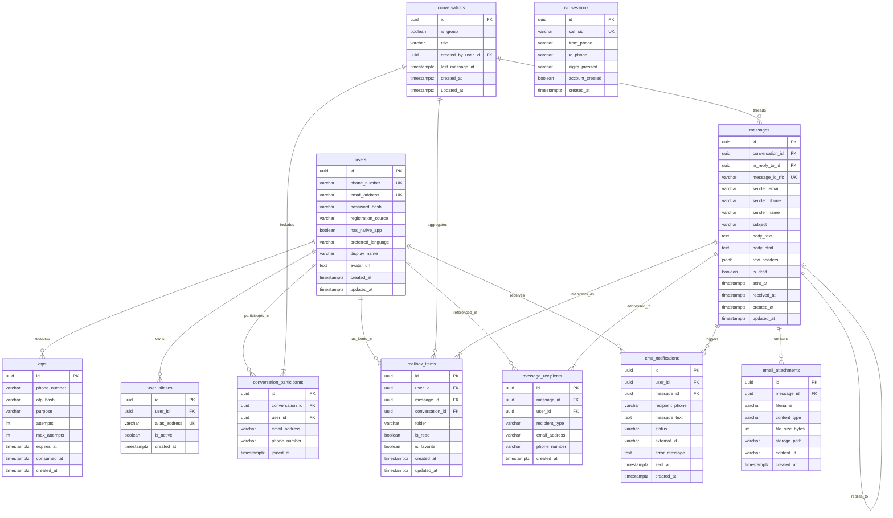

# PhoneMail — Database Design Specification

> **Project:** PhoneMail (ALPHASTACK 7-Day Buildathon)  
> **Status:** Revised Database Design Baseline (Post Consistency Review)  
> **Database Engine:** PostgreSQL 16  
> **Data Model Pattern:** Decoupled Canonical Messages, Multi-Recipient Addressing & Per-User Mailbox Items

---

## 1. Overview & Architectural Principles

The revised PhoneMail database decouples canonical email content, recipient addressing, and independent per-user mailbox state. This addresses the limitation of mixing message bodies with read/folder state, allowing a single email with multiple recipients to have completely independent read, favorite, folder, and trash lifecycles across recipients.

### Core Principles
1. **Explicit Native App Capability (`has_native_app`):** The `users` table tracks whether the user has a registered native mobile application (`has_native_app`). Responsive mobile web usage does **NOT** alter this flag and does **NOT** suppress SMS notifications.
2. **Canonical Message Immutability (`messages`):** Represents the RFC 5322 MIME message payload (subject, bodies, headers, sender, timestamp). RFC `Message-ID` uniqueness is enforced at this canonical level.
3. **Multi-Recipient Decoupling (`message_recipients`):** Enables proper `TO`, `CC`, and `BCC` categorization with explicit linkage to registered PhoneMail users or external email addresses.
4. **Independent User Mailbox State (`mailbox_items`):** Each recipient (as well as the sender) possesses their own `mailbox_items` row referencing the canonical message, tracking independent folder (`HOME`, `SENT`, `DRAFTS`, `SPAM`, `TRASH`), read/unread, and favorite flags.
5. **Unified Drafts Architecture:** Drafts are stored cleanly within `messages` (`is_draft = true`) and `mailbox_items` (`folder = 'DRAFTS'`), eliminating the need for speculative separate draft tables.

---

## 2. Entity-Relationship Diagram (Mermaid)



---

## 3. Data Dictionary

### 3.1 Table: `users`
| Column | Type | Nullable | Default | Description / Constraints |
| :--- | :--- | :--- | :--- | :--- |
| `id` | `UUID` | No | `gen_random_uuid()` | Primary Key |
| `phone_number` | `VARCHAR(20)` | No | - | Normalized unique phone number (e.g. `9888820532`) |
| `email_address` | `VARCHAR(255)` | No | - | Normalized unique address (e.g. `9888820532@phonemail.com`) |
| `password_hash` | `VARCHAR(255)` | Yes | `NULL` | Bcrypt hash for fallback authentication (Req 6.3.2) |
| `registration_source` | `VARCHAR(20)` | No | `'WEB'` | `WEB`, `MOBILE_WEB`, `IVR`, `SMS`, `NATIVE_APP` |
| `has_native_app` | `BOOLEAN` | No | `false` | True ONLY if registered native mobile application is present. Responsive mobile web does NOT toggle this! |
| `preferred_language` | `VARCHAR(10)` | No | `'en'` | Language code selected during onboarding (Req 6.4 Screen 1) |
| `display_name` | `VARCHAR(100)` | Yes | `NULL` | User full or friendly name |
| `avatar_url` | `TEXT` | Yes | `NULL` | Profile picture URI |
| `created_at` | `TIMESTAMPTZ` | No | `NOW()` | Account creation timestamp |
| `updated_at` | `TIMESTAMPTZ` | No | `NOW()` | Record update timestamp |

---

### 3.2 Table: `otps`
| Column | Type | Nullable | Default | Description / Constraints |
| :--- | :--- | :--- | :--- | :--- |
| `id` | `UUID` | No | `gen_random_uuid()` | Primary Key |
| `phone_number` | `VARCHAR(20)` | No | - | Recipient phone number |
| `otp_hash` | `VARCHAR(64)` | No | - | SHA-256 hash of the 6-digit passcode |
| `purpose` | `VARCHAR(20)` | No | `'LOGIN'` | `LOGIN`, `REGISTRATION` |
| `attempts` | `INT` | No | `0` | Number of failed verification attempts |
| `max_attempts` | `INT` | No | `3` | Maximum allowed attempts before lockout |
| `expires_at` | `TIMESTAMPTZ` | No | - | Timestamp when OTP expires (created_at + 5 min) |
| `consumed_at` | `TIMESTAMPTZ` | Yes | `NULL` | Timestamp when successfully redeemed |
| `created_at` | `TIMESTAMPTZ` | No | `NOW()` | Creation timestamp |

---

### 3.3 Table: `user_aliases`
| Column | Type | Nullable | Default | Description / Constraints |
| :--- | :--- | :--- | :--- | :--- |
| `id` | `UUID` | No | `gen_random_uuid()` | Primary Key |
| `user_id` | `UUID` | No | - | Foreign Key -> `users(id)` ON DELETE CASCADE |
| `alias_address` | `VARCHAR(255)` | No | - | Unique alias email address |
| `is_active` | `BOOLEAN` | No | `true` | Active status toggle |
| `created_at` | `TIMESTAMPTZ` | No | `NOW()` | Creation timestamp |

---

### 3.4 Table: `conversations`
Represents an email thread or chat conversation for the mobile WhatsApp-style interaction model.
| Column | Type | Nullable | Default | Description / Constraints |
| :--- | :--- | :--- | :--- | :--- |
| `id` | `UUID` | No | `gen_random_uuid()` | Primary Key |
| `is_group` | `BOOLEAN` | No | `false` | True if multiple recipients (Req 6.11) |
| `title` | `VARCHAR(255)` | Yes | `NULL` | Subject of first message or custom group name |
| `created_by_user_id` | `UUID` | Yes | `NULL` | Foreign Key -> `users(id)` ON DELETE SET NULL |
| `last_message_at` | `TIMESTAMPTZ` | No | `NOW()` | Timestamp of newest message (for sorting chat feed) |
| `created_at` | `TIMESTAMPTZ` | No | `NOW()` | Creation timestamp |
| `updated_at` | `TIMESTAMPTZ` | No | `NOW()` | Update timestamp |

---

### 3.5 Table: `conversation_participants`
Links users and external email addresses to a conversation.
| Column | Type | Nullable | Default | Description / Constraints |
| :--- | :--- | :--- | :--- | :--- |
| `id` | `UUID` | No | `gen_random_uuid()` | Primary Key |
| `conversation_id` | `UUID` | No | - | Foreign Key -> `conversations(id)` ON DELETE CASCADE |
| `user_id` | `UUID` | Yes | `NULL` | Foreign Key -> `users(id)` ON DELETE SET NULL (NULL for external contacts) |
| `email_address` | `VARCHAR(255)` | No | - | Email address of the participant |
| `phone_number` | `VARCHAR(20)` | Yes | `NULL` | Phone number if participant is a PhoneMail user |
| `joined_at` | `TIMESTAMPTZ` | No | `NOW()` | Timestamp joined |

---

### 3.6 Table: `messages` (Canonical Message Store)
Stores the immutable canonical email message payload and RFC metadata.
| Column | Type | Nullable | Default | Description / Constraints |
| :--- | :--- | :--- | :--- | :--- |
| `id` | `UUID` | No | `gen_random_uuid()` | Primary Key |
| `conversation_id` | `UUID` | Yes | `NULL` | Foreign Key -> `conversations(id)` ON DELETE CASCADE. Nullable for standalone drafts (`is_draft = true`). Required for non-draft messages via constraint `chk_messages_conversation_req`. |
| `in_reply_to_id` | `UUID` | Yes | `NULL` | Self-referencing FK -> `messages(id)` ON DELETE SET NULL. Enforced unique per parent message via `idx_messages_single_reply` (Req 6.9). |
| `message_id_rfc` | `VARCHAR(255)` | Yes | `NULL` | RFC 5322 `Message-ID` (Unique across sent/received emails; NULL for unsent drafts) |
| `sender_email` | `VARCHAR(255)` | No | - | Sender email address |
| `sender_phone` | `VARCHAR(20)` | Yes | `NULL` | Extracted phone number if internal sender |
| `sender_name` | `VARCHAR(100)` | Yes | `NULL` | Display name of sender |
| `subject` | `VARCHAR(500)` | No | `''` | Email subject line |
| `body_text` | `TEXT` | Yes | `NULL` | Plain text content |
| `body_html` | `TEXT` | Yes | `NULL` | Sanitized HTML content |
| `raw_headers` | `JSONB` | Yes | `'{}'` | Parsed MIME headers |
| `is_draft` | `BOOLEAN` | No | `false` | True if message is an unsent draft |
| `sent_at` | `TIMESTAMPTZ` | Yes | `NULL` | RFC Date when sent |
| `received_at` | `TIMESTAMPTZ` | No | `NOW()` | Timestamp ingested |
| `created_at` | `TIMESTAMPTZ` | No | `NOW()` | Record created |
| `updated_at` | `TIMESTAMPTZ` | No | `NOW()` | Record updated |

---

### 3.7 Table: `message_recipients`
Maintains normalized addressing for multi-recipient, CC, and BCC emails.
| Column | Type | Nullable | Default | Description / Constraints |
| :--- | :--- | :--- | :--- | :--- |
| `id` | `UUID` | No | `gen_random_uuid()` | Primary Key |
| `message_id` | `UUID` | No | - | Foreign Key -> `messages(id)` ON DELETE CASCADE |
| `user_id` | `UUID` | Yes | `NULL` | Foreign Key -> `users(id)` ON DELETE SET NULL (NULL for external recipients) |
| `recipient_type` | `VARCHAR(10)` | No | `'TO'` | `TO`, `CC`, `BCC` |
| `email_address` | `VARCHAR(255)` | No | - | Recipient email address |
| `phone_number` | `VARCHAR(20)` | Yes | `NULL` | Recipient phone if PhoneMail identity |
| `created_at` | `TIMESTAMPTZ` | No | `NOW()` | Creation timestamp |

---

### 3.8 Table: `mailbox_items`
Tracks the individual user's view, folder location, and read/favorite status for each email.
| Column | Type | Nullable | Default | Description / Constraints |
| :--- | :--- | :--- | :--- | :--- |
| `id` | `UUID` | No | `gen_random_uuid()` | Primary Key |
| `user_id` | `UUID` | No | - | Foreign Key -> `users(id)` ON DELETE CASCADE |
| `message_id` | `UUID` | No | - | Foreign Key -> `messages(id)` ON DELETE CASCADE |
| `conversation_id` | `UUID` | Yes | `NULL` | Foreign Key -> `conversations(id)` ON DELETE CASCADE. Nullable for standalone drafts (`folder = 'DRAFTS'`). Required for HOME, SENT, SPAM, and TRASH items via constraint `chk_mailbox_conversation_req`. |
| `folder` | `VARCHAR(20)` | No | `'HOME'` | `HOME`, `SENT`, `DRAFTS`, `SPAM`, `TRASH` |
| `is_read` | `BOOLEAN` | No | `false` | Independent read/unread state |
| `is_favorite` | `BOOLEAN` | No | `false` | Independent starred/favorite state |
| `created_at` | `TIMESTAMPTZ` | No | `NOW()` | Ingest timestamp into mailbox |
| `updated_at` | `TIMESTAMPTZ` | No | `NOW()` | State update timestamp |

*Constraint:* Unique on `(user_id, message_id)`.

---

### 3.9 Table: `email_attachments`
Stores metadata and disk storage locations for message attachments.
| Column | Type | Nullable | Default | Description / Constraints |
| :--- | :--- | :--- | :--- | :--- |
| `id` | `UUID` | No | `gen_random_uuid()` | Primary Key |
| `message_id` | `UUID` | No | - | Foreign Key -> `messages(id)` ON DELETE CASCADE |
| `filename` | `VARCHAR(255)` | No | - | Original uploaded filename |
| `content_type` | `VARCHAR(100)` | No | - | MIME type (e.g. `image/png`, `application/pdf`) |
| `file_size_bytes` | `INT` | No | `0` | Size in bytes |
| `storage_path` | `VARCHAR(500)` | No | - | Relative path inside attachment volume |
| `content_id` | `VARCHAR(100)` | Yes | `NULL` | Inline CID if image |
| `created_at` | `TIMESTAMPTZ` | No | `NOW()` | Creation timestamp |

---

### 3.10 Table: `sms_notifications`
Audit trail of SMS alerts dispatched to non-native-app users upon email receipt (Req 6.16).
| Column | Type | Nullable | Default | Description / Constraints |
| :--- | :--- | :--- | :--- | :--- |
| `id` | `UUID` | No | `gen_random_uuid()` | Primary Key |
| `user_id` | `UUID` | No | - | Foreign Key -> `users(id)` ON DELETE CASCADE |
| `message_id` | `UUID` | No | - | Foreign Key -> `messages(id)` ON DELETE CASCADE |
| `recipient_phone` | `VARCHAR(20)` | No | - | Destination phone number |
| `message_text` | `TEXT` | No | - | Exact body sent |
| `status` | `VARCHAR(20)` | No | `'QUEUED'` | `QUEUED`, `SENT`, `FAILED`, `MOCKED` |
| `external_id` | `VARCHAR(100)` | Yes | `NULL` | Twilio SMS SID |
| `error_message` | `TEXT` | Yes | `NULL` | Error description if failed |
| `sent_at` | `TIMESTAMPTZ` | Yes | `NULL` | Dispatch timestamp |
| `created_at` | `TIMESTAMPTZ` | No | `NOW()` | Record created |

---

### 3.11 Table: `ivr_sessions`
Tracks calls received via the toll-free number for IVR account creation (Req 6.1.1, 6.17).
| Column | Type | Nullable | Default | Description / Constraints |
| :--- | :--- | :--- | :--- | :--- |
| `id` | `UUID` | No | `gen_random_uuid()` | Primary Key |
| `call_sid` | `VARCHAR(100)` | No | - | Twilio Call SID |
| `from_phone` | `VARCHAR(20)` | No | - | Caller's phone number |
| `to_phone` | `VARCHAR(20)` | No | - | Dialed toll-free number |
| `digits_pressed` | `VARCHAR(5)` | Yes | `NULL` | DTMF digits captured (e.g. `'1'`) |
| `account_created` | `BOOLEAN` | No | `false` | True if account was created |
| `created_at` | `TIMESTAMPTZ` | No | `NOW()` | Timestamp received |

---

## 4. Indexing & Query Optimization Strategy

```sql
-- Canonical User lookups
CREATE UNIQUE INDEX idx_users_phone ON users(phone_number);
CREATE UNIQUE INDEX idx_users_email ON users(email_address);

-- OTP lookups and expirations
CREATE INDEX idx_otps_phone_created ON otps(phone_number, created_at DESC);
CREATE INDEX idx_otps_active ON otps(phone_number, consumed_at, expires_at);

-- Mobile Conversations Feed
CREATE INDEX idx_conversations_last_msg ON conversations(last_message_at DESC);
CREATE INDEX idx_conv_participants_user ON conversation_participants(user_id, conversation_id);
CREATE INDEX idx_conv_participants_email ON conversation_participants(email_address);

-- Canonical Messages & Threading
CREATE UNIQUE INDEX idx_messages_rfc_id ON messages(message_id_rfc) WHERE message_id_rfc IS NOT NULL;
CREATE INDEX idx_messages_conversation ON messages(conversation_id, created_at ASC);

-- Single-Reply Constraint: Enforces that one parent message can have at most one reply
CREATE UNIQUE INDEX idx_messages_single_reply
ON messages(in_reply_to_id)
WHERE in_reply_to_id IS NOT NULL;

-- Multi-recipient addressing lookups
CREATE INDEX idx_msg_recipients_msg ON message_recipients(message_id);
CREATE INDEX idx_msg_recipients_user ON message_recipients(user_id);
CREATE INDEX idx_msg_recipients_phone ON message_recipients(phone_number);

-- Independent User Mailbox Queries (Gmail-style view)
CREATE UNIQUE INDEX idx_mailbox_user_msg ON mailbox_items(user_id, message_id);
CREATE INDEX idx_mailbox_user_folder ON mailbox_items(user_id, folder, created_at DESC);
CREATE INDEX idx_mailbox_filters ON mailbox_items(user_id, is_read, is_favorite);

-- Full-Text Search on Canonical Messages
ALTER TABLE messages ADD COLUMN search_vector tsvector 
    GENERATED ALWAYS AS (to_tsvector('english', coalesce(subject, '') || ' ' || coalesce(body_text, ''))) STORED;
CREATE INDEX idx_messages_fts ON messages USING GIN(search_vector);

-- Integrity Constraints: Standalone Drafts vs Conversation Messages
ALTER TABLE messages ADD CONSTRAINT chk_messages_conversation_req 
    CHECK (is_draft = true OR conversation_id IS NOT NULL);

ALTER TABLE mailbox_items ADD CONSTRAINT chk_mailbox_conversation_req 
    CHECK (folder = 'DRAFTS' OR conversation_id IS NOT NULL);
```

---

## 5. Lifecycle & Transactional Flow Rules

### 5.1 Inbound Delivery Flow
When an email is ingested via SMTP addressed to `9888820532@phonemail.com`:
1. Insert canonical row into `messages`.
2. Insert row into `message_recipients` with `recipient_type = 'TO'`, `phone_number = '9888820532'`.
3. Resolve user `users.id` matching `9888820532`.
4. Insert row into `mailbox_items` with `user_id = recipient_user.id`, `folder = 'HOME'`, `is_read = false`.
5. Check `recipient_user.has_native_app`:
   - If `false`, insert row into `sms_notifications` and trigger dispatch.

### 5.2 Draft Lifecycle Flow
1. **Create Draft:** Insert into `messages` (`is_draft = true`, `conversation_id` may be `NULL` for standalone drafts), insert recipient rows into `message_recipients`, and insert into `mailbox_items` (`user_id = author.id`, `folder = 'DRAFTS'`, `conversation_id` may be `NULL`).
2. **Update Draft:** Update `subject`, `body_text`, `body_html` in `messages`, update recipient list in `message_recipients`.
3. **Send Draft:**
   - If `conversation_id` is null, resolve or create the conversation for the recipients and assign it to `messages.conversation_id` and author's `mailbox_items.conversation_id`.
   - Set `messages.is_draft = false`, allocate RFC `message_id_rfc`.
   - Update author's `mailbox_items.folder = 'SENT'`.
   - For all internal recipients, create their respective `mailbox_items` with `folder = 'HOME'` and the resolved `conversation_id`.
   - For external recipients, queue outbound delivery via `nodemailer`.
4. **Delete Draft:** Delete author's `mailbox_items` row and cascade remove the unreferenced draft `messages` row.

### 5.3 Single-Reply Database Enforcement
The PostgreSQL partial unique index `idx_messages_single_reply` enforces at the database level that any parent message (`in_reply_to_id`) can be referenced at most once by a reply message.
```sql
CREATE UNIQUE INDEX idx_messages_single_reply
ON messages(in_reply_to_id)
WHERE in_reply_to_id IS NOT NULL;
```
If a client attempts to create a second reply referencing an already-replied message, PostgreSQL raises a uniqueness constraint violation error (`23505: unique_violation`). The backend API / service layer catches this database exception and returns `HTTP 409 Conflict` with:
```json
{
  "success": false,
  "error": {
    "code": "ALREADY_REPLIED",
    "message": "The referenced message has already been replied to."
  }
}
```
This guarantees complete consistency with Requirement 6.9 (*"Each message may be replied to only once"*) directly at the persistence layer.

### 5.4 Standalone Drafts and Conversation Integrity Rules
1. **Standalone Drafts Allowed:** Standalone drafts created via `POST /api/v1/drafts` with `"conversationId": null` are persisted with `messages.conversation_id = NULL` and `mailbox_items.conversation_id = NULL`.
2. **Conversation Enforcement for Non-Drafts:** The PostgreSQL database constraints `chk_messages_conversation_req` and `chk_mailbox_conversation_req` enforce that any message that is not a draft (`is_draft = false`) and any mailbox item in a standard folder (`HOME`, `SENT`, `SPAM`, `TRASH`) **must** be linked to a valid `conversation_id`.
3. **Draft Promotion on Send:** When an author dispatches a draft via `POST /api/v1/drafts/:id/send`, if the draft is standalone (`conversation_id` is null), the backend resolves or creates the conversation matching the recipients, sets `messages.conversation_id` and the sender's `mailbox_items.conversation_id`, and sets `folder = 'SENT'` alongside `is_draft = false`, satisfying both database constraints atomically in the same transaction.
