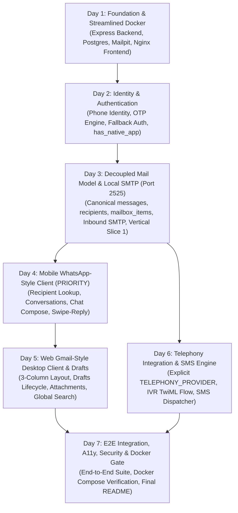

# PhoneMail — 7-Day Buildathon Implementation Plan

> **Project:** PhoneMail (ALPHASTACK 7-Day Buildathon)  
> **Status:** Revised Implementation Plan Baseline (Post Consistency Review)  
> **Backend Framework:** Node.js 20 LTS + TypeScript + Express (Frozen)  
> **Local SMTP:** Port 2525 (Standard Unprivileged Demo/Development Port)  
> **Docker Topology:** 4 Services (`frontend`, `backend`, `postgres`, `mailpit`)  
> **Methodology:** Incremental SDLC with Vertical Slices & Strict Prioritization

---

## 1. Executive Summary & Critical Path

The implementation sequence follows strict prioritization:
1. Core Email Functionality & Normalization
2. Mobile Client (WhatsApp-style UX)
3. Web Client (Gmail-style Desktop UX)
4. Local SMTP (Port 2525)
5. Authentication (OTP with Password Fallback)
6. Telephony Integration (IVR & SMS Notification)
7. Security & Accessibility Hardening

---

## 2. Daily Implementation Sequence

### Day 1: Foundation, Streamlined Docker & Database Scaffolding
*Objective: Deploy a reproducible 4-container environment via `docker compose up -d`.*

- **Tasks:**
  1. Initialize repository structure:
     - `/backend`: Node.js 20 LTS, TypeScript 5, Express.
     - `/frontend`: React 18, Vite, Tailwind CSS, Nginx reverse proxy configuration.
  2. Configure `docker-compose.yml` declaring 4 services:
     - `frontend`: Nginx proxying `/api` and `/events` to `http://backend:4000`, host port `3000`.
     - `backend`: Express API on `4000`, Inbound SMTP on `2525` (host port `2525`).
     - `postgres`: PostgreSQL 16 on `5432`.
     - `mailpit`: SMTP relay on `1025`, web inspector on `8025`.
  3. Initialize database migrations implementing the normalized schema (`users`, `otps`, `user_aliases`, `conversations`, `conversation_participants`, `messages`, `message_recipients`, `mailbox_items`, `email_attachments`, `sms_notifications`, `ivr_sessions`).
  4. Implement `GET /api/v1/health` verifying database connectivity and configuration.
- **Verification Gate:**
  - `docker compose up -d` boots all 4 containers cleanly.
  - `curl http://localhost:3000/api/v1/health` returns status `healthy`.

---

### Day 2: Identity, Authentication & Explicit App Capability
*Objective: Build phone-based authentication and phone-to-email address allocation.*

- **Tasks:**
  1. Implement Phone Number Normalizer and Address Generator (`${phone}@${EMAIL_DOMAIN}`).
  2. Implement OTP Engine:
     - Cryptographic 6-digit generation.
     - SHA-256 storage with salt, 5-minute expiry, max 3 attempts limit.
  3. Implement `/api/v1/auth/request-otp` and `/api/v1/auth/verify-otp` (strict OTP verification returning verificationToken).
  4. Implement explicit account creation endpoints `/api/v1/auth/register` and `/api/v1/auth/register-web` (2 visible inputs: Phone and OTP), plus `/api/v1/auth/login-otp`.
  5. Implement password authentication fallback `/api/v1/auth/login-password` with `bcrypt`.
  6. Add native mobile registration endpoint `POST /api/v1/user/native-device` to toggle `has_native_app = true`. Ensure web logins leave `has_native_app = false`.
  7. Implement JWT token issuing and authentication middleware.
- **Verification Gate:**
  - Automated tests pass for: request OTP (REGISTRATION) -> verify OTP -> register -> JWT issued -> address assigned; and request OTP (LOGIN) -> verify OTP -> login-otp -> JWT issued.
  - Logging in via web maintains `has_native_app = false`. Calling native device endpoint sets `has_native_app = true`.

---

### Day 3: Decoupled Mail Model & Local SMTP on Port 2525 (Vertical Slice 1)
*Objective: Implement canonical message ingestion, multi-recipient fanout, and local SMTP transport.*

- **Tasks:**
  1. Build Inbound SMTP Server (`smtp-server`) listening on port `2525`.
  2. Integrate `mailparser` to stream and parse raw RFC 5322 MIME messages.
  3. Implement Mail Ingestion Pipeline:
     - Store immutable email payload in `messages`.
     - Parse and record `TO`, `CC`, `BCC` in `message_recipients`.
     - Generate recipient `mailbox_items` (`folder = 'HOME'`, `is_read = false`).
     - Associate or create `conversations` for threading.
  4. Implement Outbound SMTP Transport with `nodemailer` routing to `mailpit:1025`.
  5. Implement direct send `/api/v1/emails/send` and attachment upload `/api/v1/attachments/upload`.
  6. Implement Server-Sent Events `/api/v1/events` to push `NEW_EMAIL` events.
- **Verification Gate (First Vertical Slice Complete):**
  - External SMTP client sends an email to `9888820532@phonemail.com` on host port `2525`.
  - Email is parsed, persisted in `messages`, fanout creates `mailbox_items`, and is retrievable via `GET /api/v1/emails`.
  - Outbound email sent via API arrives in Mailpit on host port `8025`.

---

### Day 4: Mobile WhatsApp-Style Client (Primary Priority)
*Objective: Build the prioritized mobile conversation and chat compose experience.*

- **Tasks:**
  1. Implement Mobile Recipient Search and Conversation APIs:
     - `GET /api/v1/mobile/recipients/lookup`: Search phone number or email, check if registered, return existing conversation ID.
     - `POST /api/v1/mobile/conversations/open`: Open existing or create new 1-to-1 conversation.
  2. Build 4-step mobile onboarding flow:
     - Screen 1: Language selection (`en`, `hi`, etc.).
     - Screen 2: Terms & Conditions acceptance.
     - Screen 3: Phone number entry & auto-fill simulation.
     - Screen 4: OTP verification.
  3. Build Mobile Home Screen:
     - Full-width top search bar.
     - Filter chips (`All`, `Unread`, `Attachments`, `Favorites`).
     - Drawer menu (`Home`, `Drafts`, `Spam`, `Trash`).
     - Conversation list sorted by `last_message_at DESC`.
  4. Build Mobile Conversation View:
     - Chat bubbles (left for inbound, right for outbound).
     - Subject field visible on new email, automatically hidden on reply.
     - Swipe-to-reply gesture setting `in_reply_to_id`.
     - Enforce single-reply restriction per message.
     - Toggle to view full traditional email view.
  5. Build Floating Action Button for chat compose (phone lookup -> open chat -> send).
- **Verification Gate:**
  - Complete mobile flow verified in browser: Onboarding -> search phone -> start conversation -> compose -> send -> swipe-to-reply -> toggle traditional view.

---

### Day 5: Web Desktop Client & Complete Drafts Lifecycle
*Objective: Build the Gmail-style desktop interface and full draft lifecycle.*

- **Tasks:**
  1. Implement complete Drafts Lifecycle APIs:
     - `POST /api/v1/drafts`: Create draft (`messages.is_draft = true`, `mailbox_items.folder = 'DRAFTS'`).
     - `GET /api/v1/drafts`: List active user drafts.
     - `GET /api/v1/drafts/:id`: Get single draft details.
     - `PUT /api/v1/drafts/:id`: Update draft content and recipients.
     - `DELETE /api/v1/drafts/:id`: Delete draft.
     - `POST /api/v1/drafts/:id/send`: Send finalized draft via SMTP.
  2. Build Gmail-style 3-column desktop layout:
     - Left sidebar: `+ Compose`, `Home`, `Drafts`, `Spam`, `Trash`, `Aliases`.
     - Central table: Checkbox, star toggle, sender, subject snippet, date, read status.
     - Reading pane: Full RFC headers, sanitized HTML body, download attachments.
  3. Build Floating Compose Modal:
     - Expandable `To`, `CC`, `BCC`, `Subject`, rich text area.
     - Draft auto-saving and discard actions.
  4. Implement Minimal Web Registration modal (Phone, OTP, Next, Terms link).
  5. Implement Global Search bar with query highlighting.
  6. Add Interface Switcher widget allowing instant switching between Mobile and Web representations.
  7. Implement Alias Management endpoints (`GET /api/v1/user/aliases`, `POST /api/v1/user/aliases`, `DELETE /api/v1/user/aliases/:id`) and web sidebar alias manager view.
- **Verification Gate:**
  - Web client verified in desktop browser: Web registration, viewing mailbox items, drafting an email, editing draft, sending draft, starring, moving to trash, and creating/deactivating an alias.

---

### Day 6: Telephony Integration (Twilio & Mock Engine)
*Objective: Implement IVR and SMS account creation alongside the SMS notification engine with explicit provider configuration.*

- **Tasks:**
  1. Implement `ITelephonyService` with explicit `TELEPHONY_PROVIDER` config:
     - `MockTelephonyService` (default): Logs SMS to stdout and in-memory store.
     - `TwilioService`: Dispatches calls/texts via official Twilio SDK.
  2. Implement IVR Voice Webhook `/api/v1/telephony/ivr/voice`:
     - Generates TwiML greeting: `<Gather numDigits="1"> "Press 1 to create account."`
  3. Implement IVR Gather Webhook `/api/v1/telephony/ivr/gather`:
     - Reads DTMF digit `1`, creates user account (`has_native_app = false`), assigns PhoneMail address, sends confirmation SMS.
  4. Implement Inbound SMS Account Creation Webhook `POST /api/v1/telephony/sms/inbound`:
     - Validates webhook signature (`X-Twilio-Signature` when `TELEPHONY_PROVIDER=twilio`).
     - Normalizes incoming sender phone number (`From`).
     - Idempotently creates user account (`registration_source = 'SMS'`, `has_native_app = false`).
     - Assigns `${phone}@${EMAIL_DOMAIN}` and sends confirmation SMS.
     - Responds with TwiML `<Response><Message>...</Message></Response>`.
  5. Implement SMS Notification Dispatcher:
     - Ingestion pipeline checks recipient user status: if `has_native_app == false`, format and dispatch SMS: `You have received an email from <Sender>. Subject: <Subject>.`
     - Note: Responsive mobile web users continue receiving SMS notifications!
  6. Provide Mock Telephony inspection and simulation tools:
     - `POST /api/v1/telephony/mock/simulate-sms`: Simulates inbound SMS account creation locally without Twilio.
     - `POST /api/v1/telephony/mock/simulate-call`: Simulates inbound IVR call locally.
     - `GET /api/v1/telephony/mock/messages`: View simulated outbound SMS logs.
- **Verification Gate:**
  - Simulating an IVR call creates an account with `has_native_app: false`.
  - Simulating an inbound SMS via `/api/v1/telephony/mock/simulate-sms` creates an account with `registration_source: 'SMS'`, `has_native_app: false`, assigns `phone@phonemail.com`, and records confirmation SMS in mock messages log. Repeated SMS from the same number is handled idempotently without error.
  - Sending an email to an IVR- or SMS-registered user triggers an automated SMS notification.

---

### Day 7: Testing, Hardening, Polish & Documentation
*Objective: Verify full integration, security, accessibility, and finalize buildathon documentation.*

- **Tasks:**
  1. Security Audit:
     - Sanitize all inbound HTML email content with `sanitize-html` before persistence.
     - Rate-limit OTP endpoints.
     - Parameterize all SQL queries.
  2. Accessibility Review:
     - Verify WCAG color contrast, ARIA labels on buttons, and keyboard navigation.
  3. Execute automated end-to-end test suite:
     - Web Registration -> SMTP Inbound -> Web Mailbox.
     - Mobile Onboarding -> Phone Lookup -> Chat Compose -> Swipe Reply.
     - IVR Call -> Account Provisioned -> Inbound Email -> SMS Alert.
  4. Verify Docker Compose:
     - Execute `docker compose down -v` followed by `docker compose up -d` on clean workspace.
     - Verify all 4 containers boot healthy without manual intervention.
  5. Author comprehensive `README.md` per Requirement 11 (Overview, architecture, setup, Docker commands, API docs, demo guide).
- **Verification Gate:**
  - Single command `docker compose up -d` brings up complete application.
  - All acceptance criteria AC-01 through AC-12 confirmed passing.

---

## 3. Dependency-Aware Workstream Matrix

| Workstream | Day 1 | Day 2 | Day 3 | Day 4 | Day 5 | Day 6 | Day 7 |
| :--- | :---: | :---: | :---: | :---: | :---: | :---: | :---: |
| **Docker & Infra** | 4 Containers | - | Port 2525 Bind | - | - | - | Compose Gate |
| **Database** | Normalized DDL | Auth Indexes | Mailbox Tables | Conv Indexes | Drafts Views | IVR Sessions | Retention |
| **Backend API** | Express Server | Auth & OTP | SMTP Ingest | Recipient Search | Drafts API | Telephony API | Security Audit |
| **Local SMTP** | - | - | Inbound (2525) | - | Outbound Relay | - | Stress Test |
| **Mobile Client** | Scaffolding | - | - | Complete UX | - | - | E2E Flow |
| **Web Client** | Scaffolding | - | - | - | Complete UX | - | E2E Flow |
| **Telephony** | - | Mock Provider | - | - | - | IVR + SMS Engine| Verification |

---

## 4. Risk Mitigation Matrix

| Risk | Impact | Probability | Mitigation Strategy |
| :--- | :---: | :---: | :--- |
| **Port 25 Privilege Requirements on Host** | High | Low | Standardized completely on port `2525`. Privileged port 25 is not required. |
| **Twilio Credentials Missing or Expired** | High | Medium | Explicit `TELEPHONY_PROVIDER=mock` default allows 100% offline local development and grading. |
| **Confusing Mobile Web with Native App** | High | Low | Explicit `has_native_app` boolean field; responsive mobile web never suppresses SMS alerts. |
| **Email Multi-Recipient State Collision** | High | Low | Normalized `messages`, `message_recipients`, and `mailbox_items` schema guarantees independent per-user state. |
| **Time Crunch on Dual UIs** | Medium | Low | Unified React SPA with shared types, models, and API client; instant interface toggle switch. |
